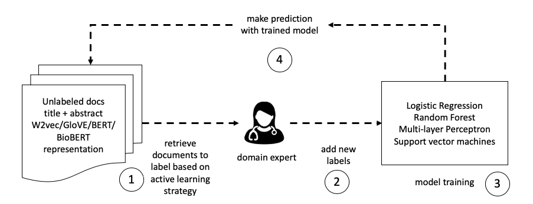

# Active Learning setting for medical documents embeddings

This repository contains the complementary material used for *Automatic Document Screening of Medical Literature Using Word and Text Embeddings in an Active Learning Setting*. 

## Dataset  
Dataset can be downloaded [here](https://zenodo.org/record/3700316#.XmNg5BP0lbg). 

Files included in the dataset are: 
- Active Learning Epistemonikos raw results 
- Active Learning HealthCLEF raw results 
- CLEF active learning ML pre-trained models 
- Epistemonikos active learning ML pre-trained models 
- CLEF BERT embeddings 
- CLEF BioBERT embeddings
- CLEF Word2Vec embeddings
- CLEF TF-IDF representations
- CLEF GloVE embeddings
- Epistemonikos BERT embeddings 
- Epistemonikos BioBERT embeddings
- Epistemonikos Word2Vec embeddings
- Epistemonikos TF-IDF representations
- Epistemonikos GloVE embeddings

To run scripts download all these files into directory `$DATASET_DIR`. 

## Training Machine Learning Models from scratch using Active Learning

We assume the dataset has been downloaded at `$DATASET_DIR`.

1. Unzip all files. 
2. Choose [Epistemonikos Active Learning](/models/active_learning_epistemonikos.ipynb) or [HealthCLEF Active Learning](/models/active_learning_clef.ipynb) to start training.  
3. Instructions to run each script are included in each Jupyter notebook. 

PD. To replicate results from relevance feedback, documents and medical questions need to be indexed in ElasticSearch. 

## Use pre-trained Machine Learning models

We assume the dataset has been downloaded at `$DATASET_DIR`. 

1. Unzip all files.  
2. Choose [Epistemonikos pre-trained models](pre_trained_models/pre-trained_models_Epistemonikos.ipynb) or [HealthCLEF pre-trained models](pre_trained_models/pre-trained_models_HealthCLEF.ipynb).
3. Instructions to run each script are included in each Jupyter notebook. 

## Use raw prediction files 

We assume the dataset has been downloaded at `$DATASET_DIR`. 

1. Unzip all files.  
2. Run [raw predictions Epistemonikos](raw_prediction_files/results_from_raw_predictions_epistemonikos.ipynb) or [raw predictions HealthCLEF](raw_prediction_files/results_from_raw_predictions_clef.ipynb).
3. Instructions to run each script are included in each Jupyter notebook. 

## Replicate results plots 
To replicate plots reported in the paper run [plot results HealthCLEF](results/plot_results_clef.ipynb) or [plot results Epistemonikos](results/plot_results_episte.ipynb). 

## Ilustration of the Active Learning approach
It starts with a set of candidate documents which based on an active learning strategy (uncertainty or random sampling) are retrieved to be labeled. Then the oracle (domain expert) adds new labels, the system uses the labels to train a machine learning model, and next it makes predictions with the latest model trained. Predictions are used to sample the new set of candidate documents.

## Results 

| dataset| embedding | model | active learning | recall@10 | MAP | lastrel%| 
|:------------:|:---------:|:-----:|:------------:|:----------:|:-----------:|:-----------------:|
Epistemonikos | Word2vec | Logistic Regression | Uncertainty Sampling | .717 | .768 | 14.8% |
HealthCLEF | BioBERT | Random Forest | Uncertainty Sampling | .571 | .910 | 4.5%|

  

 

  

 

